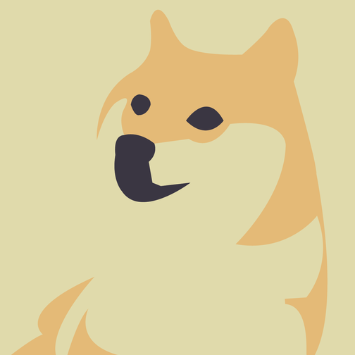

# Modeling Multi-Species Population Dynamics with Runge-Kutta

This is a project created by:
- Justin Guo (jjg283@cornell.edu)
- Bryant Har (bjh254@cornell.edu)
- Qifan Wang (qw64@cornell.edu)

Install and example use instructions are included in INSTALL.md.

## Contents
- [Introduction](#introduction)
- [Dependencies](#dependencies) 
- [Library (Parse)](#parser) 

## Introduction
We aim to generate approximate solutions to systems of differential equations for use in population modelling. Examples applications include: 
- Herbivore-Predator Model (with Refuge for Predators),
- SIR Model for infectious disease (Susceptible, Infectious, Recovered)
- Ecological model with four species - Herbivores with Refuges, Predator, Competition, Mutualism, Commensalism, and Amensalism.

## Dependencies
-lablgtk3

## Parser
Built off of the tutorial. Deriv implemented with prime notation (i.e. using ')

# | Step
1. opam install lablgtk3
2. build dune
3. make simulate
4. Once the graphs are generated in a new window, close the window to quit the simulator.
